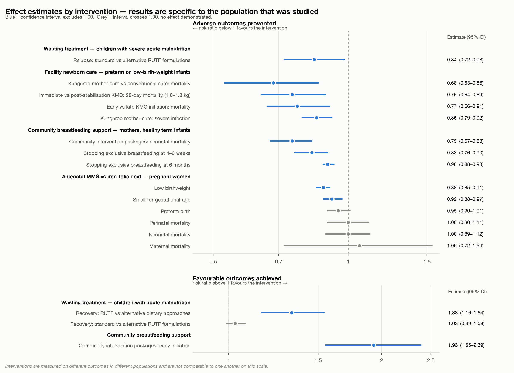
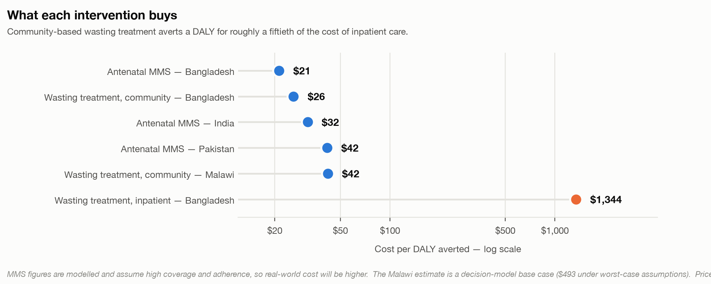
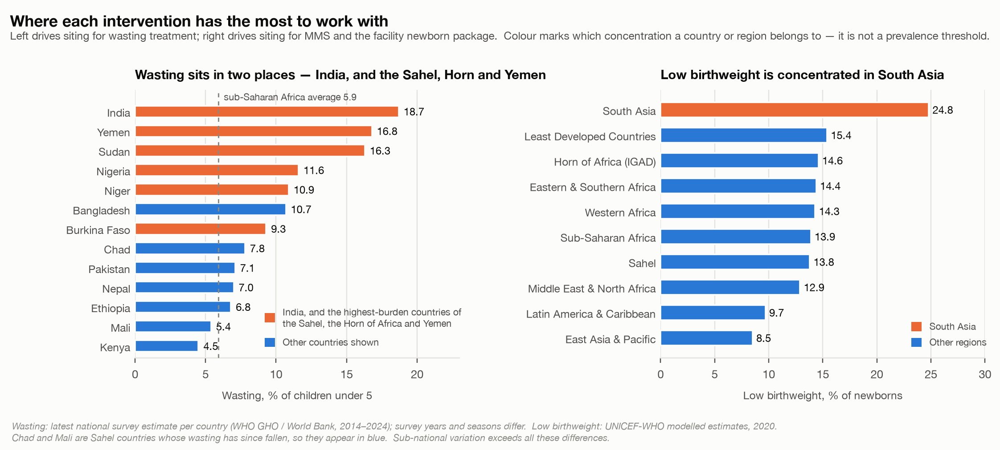
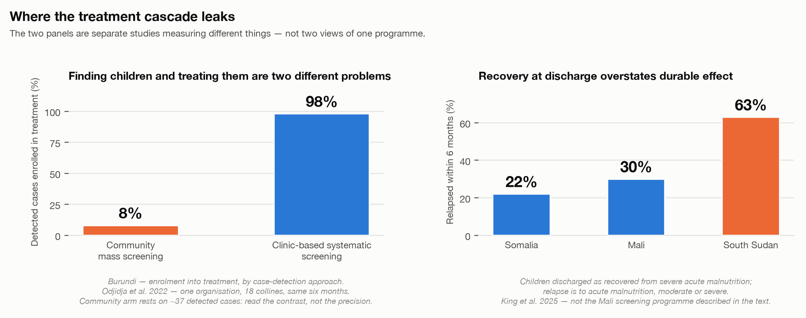

# 1. What was asked

CARE and IA partners — Save the Children and Mercy Corps — narrowed an initial 15-intervention synthesis to three: **community-based management of acute malnutrition (CMAM)**, **breastfeeding promotion and support** (disaggregated into a facility package and a community package), and **antenatal multiple micronutrient supplementation (MMS)**.

The partner steer set the scope: the evidence base is established, and **the binding constraint is adherence, coverage and sustainable operationalization rather than efficacy.** This report covers clinical effectiveness briefly and spends most of its length on cost, targeting and implementation.

**How to read the numbers.** Every effect estimate states the population it was measured in, because two of these interventions work in much narrower populations than their headline figures suggest. **RR** is a risk ratio: below 1 means fewer events, and a range crossing 1.00 is not statistically significant. **Certainty** ratings are GRADE ratings assigned by the source authors.

**Terms used in this report.**

| | |
|---|---|
| **Wasting / acute malnutrition** | Low weight for height. **SAM** = severe, **MAM** = moderate |
| **MUAC** | Mid-upper arm circumference, measured with a colour-coded tape. Under 115 mm = severe, 115–124 mm = moderate, 125 mm or more = normal. Needs no scale or height board, which is what makes community screening possible |
| **CMAM** | Community-based management of acute malnutrition — outpatient treatment of wasted children |
| **RUTF** | Ready-to-use therapeutic food — the fortified paste used to treat severe wasting |
| **Simplified protocol** | Treats severe and moderate wasting as one programme with one product, doses by severity rather than by body weight, and usually admits and discharges on MUAC alone |
| **KMC** | Kangaroo mother care — prolonged skin-to-skin contact for preterm or low-birth-weight infants |
| **Low birthweight** | Under 2,500 g at birth |
| **MMS** | Multiple micronutrient supplement, taken in pregnancy in place of iron-folic acid |
| **CHW** | Community health worker |
| **DALY** | Disability-adjusted life year — one DALY is roughly one year of healthy life lost, so "cost per DALY averted" is the price of buying back a year of healthy life |
| **RR** | Risk ratio. Below 1 = fewer events; a range crossing 1.00 is not statistically significant |
| **GRADE** | The standard system for rating certainty of evidence: high, moderate, low or very low |
| **Non-inferiority** | A trial designed to show a new approach is *not worse* than the standard by more than a pre-set margin. It does not mean better, and it does not mean identical |
| **Small-for-gestational-age** | Birthweight below the 10th percentile for gestational age — small relative to time in the womb, as distinct from low birthweight, which is an absolute cut-off |
| **Nutritional oedema** | Swelling caused by severe malnutrition. Its presence alone qualifies a child as severely wasted, whatever the MUAC reading |
| **Antenatal care (ANC)** | Routine care during pregnancy; the platform through which MMS would be delivered |

---

# 2. What the evidence shows

**They do different jobs.** CMAM treats children who are already acutely malnourished. The facility package keeps small and sick babies alive. The community package changes feeding behaviour across a population. MMS makes babies bigger at birth. A single ranking across them would be misleading.

| | What the evidence establishes | What it does not show | Binding constraint |
|---|---|---|---|
| **CMAM** | Outpatient treatment of acute malnutrition works, and how to deliver it. Therapeutic food beats alternative dietary approaches on recovery (RR 1.33); different formulations recover children equally well at high certainty, though standard RUTF reduces relapse (RR 0.84) | The size of the benefit against no treatment — never trialled, and now unethical to trial. Cohort data put severe wasting at **11.6× the mortality hazard** of children with normal weight-for-height | **Coverage** — roughly one severely wasted child in three receives treatment |
| **Breastfeeding — facility package** | In **preterm or low-birth-weight infants**, kangaroo mother care cuts mortality **RR 0.68 (0.53–0.86)**, high certainty. WHO 2022 recommends starting as soon as possible after birth, strong recommendation | That it applies to newborns generally — the eligible population is roughly one birth in seven, and closer to one in four in South Asia | **Facility delivery coverage** and ward staffing |
| **Breastfeeding — community package** | Support works delivered by professionals *or* peers; an intermediate contact intensity of four to eight visits may work best. Community packages cut neonatal mortality RR 0.75 | That any cadre delivers it better than another; the breastfeeding-specific share of the package's mortality benefit | **Contact intensity and coverage** |
| **MMS** | Outperforms iron-folic acid on **birth size** — low birthweight **RR 0.88**, high certainty; small-for-gestational-age RR 0.92, moderate certainty. Benefit is largest in anaemic and underweight women | Any reduction in perinatal or neonatal mortality — both null at high certainty. Maternal mortality is also null but imprecise (RR 1.06, 0.72–1.54) and not GRADE-rated | **Adherence and antenatal attendance**, then supply chain |

*The binding-constraint column is where the work is. None of these is an efficacy problem; all three are behavioural and operational.*

{width=6.5in}

**Coverage is the headline failure.** Just **one in three** severely wasted children receives treatment (Global Action Plan on Child Wasting, UN agencies); the last broad multi-country survey put mean programme coverage at 38.3% across 44 assessments in 21 countries, and its authors flagged a selection bias toward higher-performing programmes, so the true figure is lower (Rogers et al., *PLoS ONE* 2015). Roughly two in three children with severe wasting go untreated.

**CMAM's case rests on the counterfactual, not on a trial effect.** No trial randomises children to no treatment, so every comparison in this literature is one food or protocol against another. The number that carries a finance-ministry conversation is that **severely wasted children die at roughly 11.6 times the rate of children with normal weight-for-height** (pooled analysis of ten general-population cohorts, 53,809 children — these follow children in the community, and do not compare treated with untreated). Ready-to-use therapeutic food probably improves recovery over caregiver-prepared alternatives. Different RUTF formulations recover children equally well at high certainty — but standard RUTF also reduces relapse (RR 0.84, 0.72–0.98), so substituting formulation to save money is not cost-free.

**Simplified protocols save 32–50% of therapeutic food, and one of the two leading protocols holds recovery.** In a 2025 three-arm trial in Niger, the combined SAM/MAM protocol (ComPAS, 50% less therapeutic food) met non-inferiority on both intention-to-treat and per-protocol analysis; the tapered-dose protocol (OptiMA, 32% less) met it only on intention-to-treat. Among the most severely wasted children — those with MUAC under 115 mm or oedema — **the standard protocol achieved higher recovery**, driven by attendance rather than any difference in mortality or growth. Separately, a reduced-dose trial in Burkina Faso found a small negative effect on height gain velocity, more pronounced under 12 months. Simplification is a real efficiency gain for the uncomplicated caseload and should not yet be applied uniformly to the severest children.

**Kangaroo mother care is the strongest clinical result here, and it applies to small and sick newborns — not newborns generally.** The population is preterm or low-birth-weight infants — roughly one birth in seven worldwide, and closer to one in four in South Asia. Two things bound how far the headline result travels: almost all the pooled trials started kangaroo care *after* the infant was stabilised, and the landmark WHO trial, which tested starting it immediately, enrolled only infants of 1.0–1.799 kg, compared against kangaroo care after stabilisation rather than against none, and was stopped early for benefit. WHO recommends 8–24 hours a day, as many as possible. It carries the strongest normative backing of anything in this report: WHO's 2022 guidance says start **as soon as possible after birth — a strong recommendation on high-certainty evidence.** It requires no commodity, but it does require mother and newborn kept together with clinical monitoring, so facility delivery coverage bounds its reach.

**For community breastfeeding support, individual counselling produces modest consistent gains; packages produce mortality benefits.** The packages that cut neonatal mortality by a quarter vary widely — women's groups and participatory learning, community health worker home visits, training of birth attendants, home-based newborn care — with breastfeeding support one element among several, so that benefit belongs to the package rather than to counselling alone. It is also a random-effects average across heterogeneous trials. Cochrane's 116-trial review **detected no differential effect by who delivers support** — professionals, peers or a combination — though it notes power was limited, so this is absence of evidence rather than demonstrated equivalence. Contact intensity looks like it matters, with four to eight visits the tentative optimum. Design the package and its intensity, not the cadre.

**The two breastfeeding packages are complements**, not alternatives: one supplies a mortality benefit in a small high-risk population and the initiation moment, the other the repeated contact that sustains exclusive breastfeeding to six months.

**MMS should be presented on birth outcomes rather than survival.** Its advantage over iron-folic acid is established on low birthweight at high certainty and on small-for-gestational-age at moderate certainty; no mortality outcome shows a benefit at any certainty.

**That advantage is unevenly distributed, which is the most useful targeting guidance in this report.** An individual-participant meta-analysis of 17 trials and 112,953 women found larger effects among anaemic women (low birthweight, small-for-gestational-age and six-month mortality), among underweight women (preterm birth), and in female infants (neonatal mortality). These are three of 26 subgroups examined and the interaction tests are borderline, so they indicate where benefit is likely to be greatest rather than settling the question. An earlier concern that MMS might increase neonatal mortality where most births occur at home came from an exploratory subgroup analysis and was not supported on re-analysis; a narrower question remains, since MMS formulations often contain less iron than the iron-folic acid they replace.

---

# 3. What each one buys

{width=6.5in}

**Community-based wasting treatment is a good buy.** In southern Bangladesh, treatment delivered by community health workers cost **US$26 per DALY averted**, against **US$1,344** for the inpatient standard of care in the same study — a roughly fiftyfold difference, because that comparison captures health outcomes as well as cost (Puett et al., *Health Policy and Planning* 2013;28(4):386–99). In Malawi, adding community-based management to existing health services cost **US$42 per DALY averted** in the base case of a decision-tree model, rising to $493 under worst-case assumptions (Wilford, Golden & Walker, *Health Policy and Planning* 2012;27(2):127–37).

**Measured on cost per child cured rather than per DALY, the gap is narrower but still large** — in Ethiopia, community care cost $145.50 per child cured against $320 for inpatient care. The cost composition differs in a way that matters: therapeutic food was 43% of institutional cost in the community programme there, while personnel were 47% of institutional cost inpatient. Community delivery substitutes commodity for staff — which is why RUTF price and simplified dosing dominate its cost equation.

**MMS is the cheapest intervention here, and the switch itself is nearly free.** Producing an MMS tablet costs roughly half a US cent more than an iron-folic acid tablet — about **$0.9 more across the 180 tablets of a pregnancy**. Procurement prices give a gap of the same order, around $1.4. The cost sits in the system change — antenatal contact, counselling, supply chain — not in the tablet. These figures are modelled and assume high coverage and adherence, so real-world cost will be higher; the direction is robust, the precise number is not.

**Decentralisation is not automatically cheaper.** In a randomised comparison in Pakistan, community health worker delivery cost slightly less per child *treated* but more per child *recovered*, because recovery was lower. Reach and efficiency are not the same thing.

---

# 4. Where these interventions have the most to work with

Targeting differs by intervention, because each acts on a different condition. CMAM is driven by wasting prevalence — the benefit per child is fixed, so what varies is case-finding efficiency. MMS is driven by low birthweight *and* maternal anaemia. The facility newborn package is driven by low birthweight multiplied by facility delivery coverage.

{width=6.5in}

**Low birthweight is genuinely concentrated in South Asia**, and it holds country by country — India 27.4%, Bangladesh 23.0%, Nepal 19.7%, all above the sub-Saharan African regional figure of 13.9%, including Nepal, whose wasting burden is unremarkable. For MMS and the facility newborn package, South Asia is the highest-yield region. **MMS there is the cleanest match in this report**: the only case where absolute benefit (baseline low birthweight) and relative benefit (larger in anaemic and undernourished women) point to the same geography, on the cheapest intervention of the three.

**Wasting sits in two very different places.** India is the single largest concentration in the world, at nearly 19% (2019–21 survey) in a large and stable country — the question there is integration into a functioning routine system at scale. The Sahel, the Horn of Africa and Yemen carries the other concentration, with northern Nigeria, Niger and Burkina Faso well above the sub-Saharan African average — Nigeria and Niger at roughly double it — and Sudan's most recent figure pre-dating the current war. That is where caseloads surge, where simplified protocols matter most, where WHO's provision for blanket treatment of moderate wasting in crises applies, and where relapse runs highest. **These are two concentrations needing two different programmes.**

**Two cautions.** Regional averages mislead in both directions — sub-Saharan Africa's 5.9% conceals the Sahel, South Asia's 14.1% is essentially India. And **sub-national variation almost certainly exceeds these between-country differences**: Nigeria's 11.6% national figure spans northern states far above it. Siting should be decided on sub-national data.

---

# 5. Why it doesn't scale

{width=6.5in}

**Finding children and treating them are two different problems, and a programme can succeed at one while failing at the other.** In Burundi, clinic-based systematic screening enrolled 98% of detected cases into treatment against 8% for community mass screening — a stark contrast, though the community arm rests on a small number of detected cases and a single-NGO comparison. In Mali, a programme raised screening coverage by 40 percentage points while only 7.6% of cases received appropriate treatment. Any coverage target should specify which of the two it means, and any design should measure both.

**Recovery at discharge overstates durable effect.** Within six months, 22–63% of children discharged as recovered relapse to acute malnutrition, moderate or severe. What predicts relapse is not their condition at discharge but **food insecurity and illness afterwards** — the determinants sit outside the treatment episode. WHO's 2023 guideline now recommends **cash transfers in addition to routine care to reduce relapse** in children with severe wasting — a conditional recommendation on moderate-certainty evidence, contingent on cost. It is the clearest opening in the evidence for pairing treatment with social protection.

**Supply chain is the hardest part of the MMS transition.** Implementation research across Bangladesh, Burkina Faso, Madagascar and Tanzania found supply chain "one of the most challenging aspects" in every country, with late or poor antenatal attendance and distance to facilities as barriers in all four. Enablers were consistent: government leadership, integration into existing systems rather than parallel structures, and inclusion on national essential medicines lists. Women reported preferring MMS to iron-folic acid, with fewer side effects. **The commodity substitutes into an existing channel, but the binding constraints are antenatal attendance and stock management, and the switch fixes neither.**

**What actually scales behaviour change is a system, not a contact.** Breastfeeding programming that combined intensive interpersonal counselling, mass media, community mobilisation and policy advocacy lifted exclusive breastfeeding to **87.6% in intensive areas against 53.5% elsewhere in Bangladesh**, and 57.8% against 28.4% in Viet Nam. Against baseline, that is an impact of 36.2 percentage points (21.0–51.5) and 27.9 points (17.7–38.1) respectively, under cluster-randomised evaluation. The two countries achieved comparable results through **different channels — one an NGO health programme, one government health facilities** — which is the strongest available evidence that the channel is substitutable and that a government-anchored version is achievable.

---

# 6. Three packaged options

| | **A — Facility newborn** | **B — Community treatment** | **C — Antenatal commodity** |
|---|---|---|---|
| **What it is** | Kangaroo mother care and skin-to-skin for preterm and low-birth-weight infants, plus early initiation, then community counselling at 4–8 contacts | Wasting treatment decentralised to community health workers, simplified protocol for the uncomplicated caseload, plus supervision, supply chain and post-discharge support | MMS substituted for iron-folic acid in routine antenatal care, with contact intensification, counselling and supply-chain strengthening |
| **Strongest evidence** | **Mortality in preterm/low-birth-weight infants, high certainty** | Recovery vs dietary alternatives; very large untreated mortality risk | **Low birthweight, high certainty** |
| **Cost** | Not costed at scale | **$26–42 per DALY** | **$21–42 per DALY**; ≈$0.005/tablet |
| **Best geography** | High low-birthweight settings with facility delivery — South Asia foremost | India at scale; the Sahel, Horn of Africa and Yemen in crisis conditions | South Asia, and wherever maternal anaemia is high |
| **Channel exists?** | Partly — facilities yes, postnatal contact often not | Rarely — usually needs building | **Yes** — replaces an existing commodity |
| **Normative backing** | **Strong WHO recommendation, high certainty** | Conditional; CHW delivery on very low certainty | Research-only recommendation |
| **Hardest part** | Facility coverage and staffing | Conversion to treatment, quality at scale, relapse | Antenatal attendance and supply chain |

**Three observations for choosing.** Option C substitutes into a channel that already exists while Option B usually means building a service that does not — a difference that matters more for feasibility than any effect size here. Options A and B draw on the same frontline workforce, so running both is the highest-risk configuration. And only Option A carries a high-certainty *mortality* benefit, but it reaches roughly one birth in seven, while Option C carries a high-certainty benefit on birth size and reaches every pregnancy. That is a trade-off between depth and breadth, not a ranking.

---

# 7. What a ministry will ask

**On wasting treatment.** WHO's 2023 guideline says community health workers **can** carry out assessment, classification and management or referral, with adequate training and supervision — but as a **conditional recommendation on very low certainty evidence**. It keeps dosing indexed to body weight — though it lowered the range to 150–185 kcal/kg/day and now endorses stepping down to 100–130 once a child is no longer severely wasted — and it retains dual discharge criteria. The leading simplified protocols dose by severity rather than weight and mostly discharge on MUAC alone, so a country adopting them is operating ahead of the guideline. That is defensible and fundable, but better raised early than discovered late.

**On MMS.** The position is unchanged: *"Antenatal multiple micronutrient supplements that include iron and folic acid are recommended in the context of rigorous research."* Daily iron-folic acid remains the recommended standard of care. Any scale-up conversation starts from the fact that WHO has not endorsed routine substitution.

**On kangaroo mother care.** The strongest of the three — start as soon as possible after birth, strong recommendation on high-certainty evidence.

---

# 8. What we don't know

Wasting treatment has never been trialled against no treatment and now cannot be, so its measured benefit understates the true one. Simplified protocols remain unresolved in the severest children. The breastfeeding-specific share of the community mortality benefit cannot be isolated from the packages it sits in. MMS effectiveness under real programme conditions, as opposed to efficacy under trial conditions, is largely unmeasured. And no trial combines these three interventions with one another — combining *within* an intervention is well evidenced, as is pairing one with cash, but combining across them is untested, and adding a task to a loaded community platform can displace an existing one.

**Three data layers would sharpen the targeting** before a country decision: regional and national **maternal anaemia**, **facility delivery coverage**, and **sub-national wasting prevalence**.

**And the decisive factors are not in any literature** — government appetite and current policy windows, partner operating capacity, fragility and security, and the financing landscape. The evidence can say where these interventions have the most to work with. It cannot say where they can actually be built.

---

# 9. References

Grouped by section. Where a page range could not be confirmed, the identifier is given instead.

**Wasting treatment (§2, §3, §5)**

- Schoonees A, Lombard MJ, Musekiwa A, Nel E, Volmink J. Ready-to-use therapeutic food (RUTF) for home-based nutritional rehabilitation of severe acute malnutrition in children from six months to five years of age. *Cochrane Database of Systematic Reviews* 2019;5:CD009000. PMID 31090070.
- Olofin I, McDonald CM, Ezzati M, et al. Associations of suboptimal growth with all-cause and cause-specific mortality in children under five years: a pooled analysis of ten prospective studies. *PLoS One* 2013;8(5):e64636. PMID 23734210.
- Bailey J, Opondo C, Lelijveld N, et al. A simplified, combined protocol versus standard treatment for acute malnutrition in children 6–59 months (ComPAS trial). *PLoS Medicine* 2020;17(7):e1003192. PMID 32645109.
- Daures M, Hien J, Phelan K, et al. Optimizing management of uncomplicated acute malnutrition in children in rural Niger: a 3-arm individually randomized, controlled, noninferiority trial. *American Journal of Clinical Nutrition* 2025;122(4):972–985. PMID 41043877.
- Kangas ST, Salpéteur C, Nikièma V, et al. Impact of reduced dose of ready-to-use therapeutic foods in children with uncomplicated severe acute malnutrition (MANGO trial). *PLoS Medicine* 2019;16(8):e1002887. PMID 31454351.
- King S, Marshak A, D'Mello-Guyett L, et al. Rates and risk factors for relapse among children recovered from severe acute malnutrition in Mali, South Sudan and Somalia. *Lancet Global Health* 2025;13(1):e98–e111. PMID 39706667.
- Rogers E, Myatt M, Woodhead S, Guerrero S, Alvarez JL. Coverage of community-based management of severe acute malnutrition programmes in twenty-one countries, 2012–2013. *PLoS ONE* 2015;10(6):e0128666.
- Odjidja EN, Christensen C, Gatasi G, et al. 2030 countdown to combating malnutrition in Burundi: comparison of proactive approaches for case detection and enrolment into treatment. *International Health* 2022;14(4):413–420. PMID 32003813.
- Huybregts L, Le Port A, Becquey E, et al. Impact on child acute malnutrition of integrating small-quantity lipid-based nutrient supplements into community-level screening (PROMIS trial, Mali). *PLoS Medicine* 2019. doi:10.1371/journal.pmed.1002892.

**Cost (§3)**

- Puett C, Sadler K, Alderman H, Coates J, Fiedler JL, Myatt M. Cost-effectiveness of the community-based management of severe acute malnutrition by community health workers in southern Bangladesh. *Health Policy and Planning* 2013;28(4):386–399. PMID 22879522.
- Wilford R, Golden K, Walker DG. Cost-effectiveness of community-based management of acute malnutrition in Malawi. *Health Policy and Planning* 2012;27(2):127–137. PMID 21378101.
- Tekeste A, Wondafrash M, Azene G, Deribe K. Cost effectiveness of community-based and in-patient therapeutic feeding programs to treat severe acute malnutrition in Ethiopia. *Cost Effectiveness and Resource Allocation* 2012;10:4.
- Rogers E, Guerrero S, Kumar D, et al. Evaluation of the cost-effectiveness of the treatment of uncomplicated severe acute malnutrition by lady health workers as compared to an outpatient therapeutic feeding programme in Sindh Province, Pakistan. *BMC Public Health* 2019. doi:10.1186/s12889-018-6382-9. PMID 30654780.
- Kashi B, Godin CM, Kurzawa ZA, Verney AMJ, Busch-Hallen JF, De-Regil LM. Multiple micronutrient supplements are more cost-effective than iron and folic acid: modeling results from 3 high-burden Asian countries. *Journal of Nutrition* 2019. PMID 31131412.
- Engle-Stone R, Kumordzie SM, Meinzen-Dick L, Vosti SA. Replacing iron-folic acid with multiple micronutrient supplements among pregnant women in Bangladesh and Burkina Faso: costs, impacts, and cost-effectiveness. *Annals of the New York Academy of Sciences* 2019. doi:10.1111/nyas.14132.
- Verney AMJ, Busch-Hallen JF, Walters DD, Rowe SN, Kurzawa ZA, Arabi M. Multiple micronutrient supplementation cost–benefit tool for informing maternal nutrition policy and investment decisions. *Maternal & Child Nutrition* 2023;19:e13523. PMID 37378454.

**Breastfeeding and newborn care (§2, §5)**

- Sivanandan S, Sankar MJ. Kangaroo mother care for preterm or low birth weight infants: a systematic review and meta-analysis. *BMJ Global Health* 2023;8:e010728. PMID 37277198.
- WHO Immediate KMC Study Group. Immediate "kangaroo mother care" and survival of infants with low birth weight. *New England Journal of Medicine* 2021;384:2028–2038. doi:10.1056/NEJMoa2026486.
- Medvedev MM, Tumukunde V, Mambule I, et al. Effectiveness of kangaroo mother care before clinical stabilisation versus standard care among neonates at five hospitals in Uganda (OMWaNA): a parallel-group, individually randomised controlled trial and economic evaluation. *The Lancet* 2024. doi:10.1016/S0140-6736(24)00064-3.
- Gavine A, Shinwell SC, Buchanan P, et al. Support for healthy breastfeeding mothers with healthy term babies. *Cochrane Database of Systematic Reviews* 2022;10:CD001141. PMID 36282618.
- Lassi ZS, Bhutta ZA. Community-based intervention packages for reducing maternal and neonatal morbidity and mortality and improving neonatal outcomes. *Cochrane Database of Systematic Reviews* 2015;3:CD007754. PMID 25803792.
- Menon P, Nguyen PH, Saha KK, et al. Impacts on breastfeeding practices of at-scale strategies that combine intensive interpersonal counseling, mass media, and community mobilization: results of cluster-randomized program evaluations in Bangladesh and Viet Nam. *PLoS Medicine* 2016;13(10):e1002159. PMID 27780198.

**Antenatal supplementation (§2, §5)**

- Keats EC, Haider BA, Tam E, Bhutta ZA. Multiple-micronutrient supplementation for women during pregnancy. *Cochrane Database of Systematic Reviews* 2019;3:CD004905. PMID 30873598.
- Smith ER, Shankar AH, Wu LS-F, et al. Modifiers of the effect of maternal multiple micronutrient supplementation on stillbirth, birth outcomes, and infant mortality: a meta-analysis of individual patient data from 17 randomised trials in low-income and middle-income countries. *Lancet Global Health* 2017. PMID 29025632.
- Sudfeld CR, Smith ER. New evidence should inform WHO guidelines on multiple micronutrient supplementation in pregnancy. *Journal of Nutrition* 2019. PMID 30773589.
- Thurstans-Fuller S, James P, Menezes R, et al. Introducing antenatal multiple micronutrient supplements: lessons learned from implementation research in Bangladesh, Burkina Faso, Madagascar and Tanzania. *Maternal & Child Nutrition* 2025;22(1):e70139.

**Guidelines and normative sources (§7)**

- World Health Organization. *WHO guideline on the prevention and management of wasting and nutritional oedema (acute malnutrition) in infants and children under 5 years.* Geneva: WHO, 2023.
- World Health Organization. *WHO recommendations for care of the preterm or low-birth-weight infant.* Geneva: WHO, 2022.
- World Health Organization. *WHO antenatal care recommendation on multiple micronutrient supplements during pregnancy.* Geneva: WHO, 2020.
- FAO, UNHCR, UNICEF, WFP, WHO. *Global Action Plan on Child Wasting: a framework for action to accelerate progress in preventing and managing child wasting and the achievement of the Sustainable Development Goals.* 2020.

**Burden data (§4)**

- UNICEF, World Health Organization, World Bank Group. *Joint Child Malnutrition Estimates*, 2025 edition (2024 reference year). Regional wasting and severe wasting.
- UNICEF, World Health Organization. *Global low birthweight estimates*, 2020 reference year.
- World Health Organization. *Global Health Observatory*, indicator NUTRITION_WH_2 (wasting prevalence), national survey estimates.
- World Bank. *World Development Indicators*, SH.STA.WAST.ZS (prevalence of wasting), used for Nigeria 2021.
